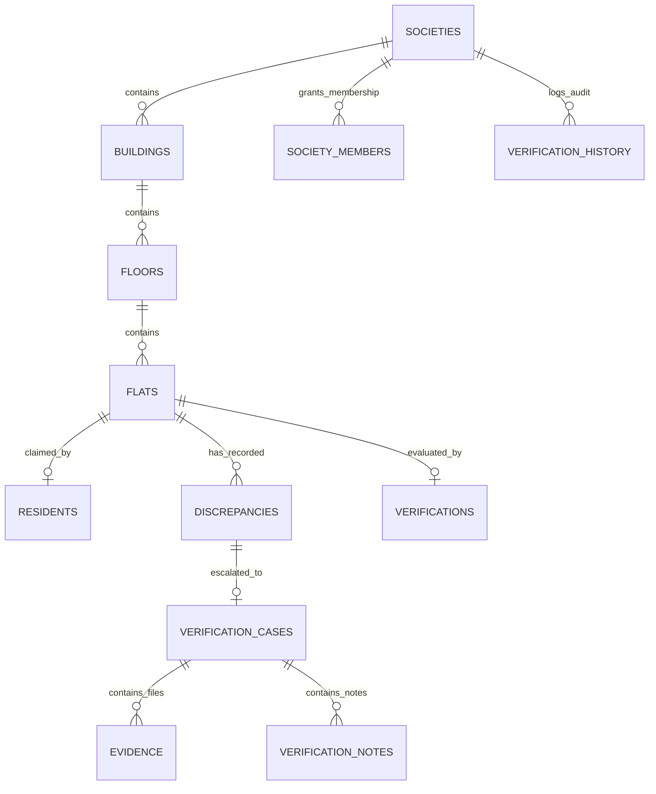

# 3D ULPIN Generation and Vertical Property Mapping System
## Comprehensive Technical & Final Project Report

---

## 1. Title Page

- **Project Title**: 3D ULPIN Generation and Vertical Property Mapping System
- **Project Domain**: Geographic Information Systems (GIS), Cadastral Mapping, Vertical Property Rights, 3D Digital Twins, and Government Civic-Tech
- **Project Type**: Full-Stack Web Application (GIS + 3D Spatial Digital Twin + Government Decision Intelligence & Verification System)
- **Primary Technology Stack**: Next.js 16 (React 19, TypeScript), Tailwind CSS, Three.js / React Three Fiber / Drei, Leaflet / React-Leaflet, Firebase (Firestore, Storage, Authentication), Framer Motion
- **Development Status**: Phases 1–14 Complete and Verified (SIH Final Submission Ready)
- **Version**: 1.0.0 (Production Build Verified — 56/56 Routes)
- **Report Date**: September 2026
- **SIH Problem Statement ID / Team ID**: *Not provided in the project repository.*
- **Government Department / Official Registration Number**: *Not provided in the project repository.*

---

## 2. Executive Summary

Traditional land administration and land title registration frameworks worldwide rely almost exclusively on two-dimensional (2D) cadastral maps. While 2D parcel mapping effectively defines horizontal land boundaries on the earth's surface, it fails fundamentally in high-density urban environments characterized by multi-story residential towers, commercial complexes, and mixed-use vertical structures. In a multi-story building, hundreds of distinct property owners share the same 2D ground footprint, creating ambiguity in spatial ownership, vertical boundary demarcations, floor-level property tax assessments, and dispute resolutions.

The **3D ULPIN Generation and Vertical Property Mapping System** resolves this fundamental limitation by bridging **2D GIS Cadastral Records** with **3D Spatial Digital Twins** and an **Authoritative Government Verification & Decision Intelligence Pipeline**.

The platform establishes an end-to-end operational hierarchy:
$$\text{Society / Parcel} \longrightarrow \text{Building} \longrightarrow \text{Floor} \longrightarrow \text{Flat / Property Unit} \longrightarrow \text{Resident / Owner}$$

Each vertical unit is mapped to a standard 14-digit Unique Land Parcel Identification Number (ULPIN / Bhu-Aadhaar format) coupled with vertical spatial sub-identifiers ($Z$-axis elevation and 3D volumetric coordinates). 

### Key Capabilities Implemented in the System:
1. **Vertical Hierarchy Management**: Complete administrative control for housing societies, structural buildings, vertical floors, and individual apartment units with duplicate detection and relational integrity.
2. **2D & 3D Interactive Spatial Mapping**: Leaflet-based 2D cadastral GIS synchronized bidirectionally with a WebGL/Three.js 3D Digital Twin environment featuring building isolation, floor slicing, explosion modes, daylight/shadow simulations, and local spatial distance measurements.
3. **Resident Registration & Privacy Protection**: Deterministic claim routing (`{societyId}_{flatId}`), strict private data isolation, and society admin approval workflows with zero public enumeration of personal identifiable information (PII).
4. **Government Officer Portal & Case Management**: End-to-end verification lifecycle for properties, formal discrepancy tracking across 9 categories and 4 severities, multi-evidence document uploads, append-only investigation notes, and binding government administrative determinations.
5. **Advanced Analytics & Executive Intelligence**: Live real-time metric aggregation from Firestore across verification rates, discrepancy distributions, case aging buckets (0–7d, 8–30d, 31–60d, 61–90d, 90+d), resolution velocity, multi-society comparison matrices, and descriptive decision support.
6. **Compliant Cadastral Reporting**: Automated generation of official Property Cadastral Verification Reports, Government Case Investigation Dossiers, and Society Verification & Inspection Reports with client-side CSV downloads and browser-native Print-to-PDF styling.

All statistical calculations, coordinates, and case decisions operate on real database states with explicit data honesty disclaimers.

---

## 3. Problem Statement

### Real-World Challenges Addressed

1. **The 2D Cadastral Bottleneck**: Traditional land survey numbers represent a single 2D polygon on the earth's surface. When a 30-story apartment tower is built on that parcel, all 200+ unit owners hold legal rights over the same 2D coordinate, making it impossible for municipal authorities, banks, or citizens to verify vertical spatial rights from 2D maps alone.
2. **Fragmented Property Records**: Building approval plans, tax assessment rolls, society membership registries, and cadastral survey numbers exist in disconnected silos. Discrepancies between sanctioned structural drawings and as-built vertical units often go undetected for years.
3. **Complex Property Disputes**: Disputes involving floor encroachments, unauthorized terrace construction, parking boundary violations, and carpet area mismatches lack an objective, spatial evidence repository.
4. **Lack of 3D Visualization for Decision-Makers**: Government verification officers and town planners are often forced to review complex architectural blueprints on paper, leading to lengthy verification backlogs and subjective determinations.
5. **Absence of Centralized Telemetry**: Municipalities lack macroscopic visibility into vertical property compliance, case resolution aging, and high-risk discrepancy clusters across urban jurisdictions.

---

## 4. Project Objectives

- [x] **Establish a Deterministic 3D Property Hierarchy**: Model societies, buildings, floors, and flats as structured relational and spatial entities.
- [x] **Standardize Spatial Identifiers**: Generate vertical-aware ULPIN-style spatial identities encoding latitude, longitude, and elevation ($Z$-axis).
- [x] **Synchronize 2D GIS with 3D Digital Twins**: Seamlessly link 2D parcel polygons to procedural and database-backed 3D building models.
- [x] **Implement Advanced 3D Spatial Inspection**: Enable floor slicing, ghost-body transparency, explode view, solar angle simulation, and local measurement tools.
- [x] **Digitize Government Verification & Case Lifecycle**: Provide government officers with full verification queues, discrepancy logging, evidence management, and audit trails.
- [x] **Enforce Strict Role-Based Security & Privacy**: Protect citizen PII through granular Firestore and Firebase Storage security rules.
- [x] **Deliver Decision-Support Intelligence & Analytics**: Offer macro and micro telemetry on verification throughput, case aging, and risk rankings.
- [x] **Provide Print-Ready Cadastral Reports**: Export standardized, disclaimer-backed inspection dossiers in PDF and CSV formats.
- [ ] *Automated AI/OCR Blueprint Extraction (Phase 11 — Planned).*
- [ ] *Direct Authoritative State Land Registry API Integration (Future Scope).*

---

## 5. System Overview & Conceptual Architecture

```
                                  ┌────────────────────────────────────────┐
                                  │           Authenticated Users          │
                                  │ (Citizen / Officer / Society / Admin) │
                                  └───────────────────┬────────────────────┘
                                                      │
                                                      ▼
                                  ┌────────────────────────────────────────┐
                                  │      Client Authentication & RBAC      │
                                  │    (AuthContext + ProtectedRoute)      │
                                  └───────────────────┬────────────────────┘
                                                      │
                                                      ▼
                                  ┌────────────────────────────────────────┐
                                  │      Application UI & Router (Next.js) │
                                  │ ┌────────────────────────────────────┐ │
                                  │ │ /map (2D GIS Leaflet Interface)   │ │
                                  │ │ /properties/[id]/digital-twin (3D) │ │
                                  │ │ /government/dashboard & analytics │ │
                                  │ │ /resident/dashboard & property     │ │
                                  │ │ /society/[societyId] admin portal  │ │
                                  │ └────────────────────────────────────┘ │
                                  └───────────────────┬────────────────────┘
                                                      │
                                                      ▼
                                  ┌────────────────────────────────────────┐
                                  │          Domain Service Layer          │
                                  │ ┌────────────────────────────────────┐ │
                                  │ │ societyService / buildingService   │ │
                                  │ │ floorService / flatService         │ │
                                  │ │ residentService / governmentService│ │
                                  │ │ verificationWorkflowService        │ │
                                  │ │ analyticsService / reportService   │ │
                                  │ └────────────────────────────────────┘ │
                                  └───────────────────┬────────────────────┘
                                                      │
                         ┌────────────────────────────┴────────────────────────────┐
                         ▼                                                         ▼
    ┌────────────────────────────────────────┐                ┌────────────────────────────────────────┐
    │     Cloud Firestore (Data Storage)     │                │     Cloud Storage (Binary Storage)     │
    │  - societies / buildings / floors      │                │  - societies/{id}/main-image/          │
    │  - flats / residents / societyMembers  │                │  - verification-evidence/{societyId}/  │
    │  - verifications / verificationCases   │                └────────────────────────────────────────┘
    │  - discrepancies / evidence / history  │
    │  - propertySpatialRecords              │
    └────────────────────────────────────────┘
```

---

## 6. User Roles & Access Control

The platform implements a Role-Based Access Control (RBAC) model operating on both the UI client router and the Cloud Firestore/Storage security rules layer:

```
                  ┌─────────────────────────────────────────────────────────┐
                  │                       User Roles                        │
                  └──────┬───────────────┬───────────────────┬──────────────┘
                         │               │                   │
                         ▼               ▼                   ▼
                  ┌─────────────┐ ┌─────────────┐    ┌──────────────┐
                  │   Citizen   │ │   Officer   │    │Society-Admin │
                  └─────────────┘ └─────────────┘    └──────────────┘
```

### 1. Citizen / Resident
- **Access**: `/resident/dashboard`, `/resident/property`, `/resident/register`, `/properties`, `/map`.
- **Permissions**: Can register self-claim on an available flat; view and update personal profile and occupancy details; inspect 2D GIS and 3D Digital Twin views of registered properties; view own verification status and property cadastral report.
- **Restrictions**: Cannot view other residents' personal details; cannot approve claims; cannot perform government verification determinations.

### 2. Society Administrator (`society-admin`)
- **Access**: `/society/[societyId]`, `/society/[societyId]/buildings`, `/society/[societyId]/residents`.
- **Permissions**: Can create and edit buildings, floors, and flats within their administered society; review, approve, or reject resident flat claims; upload society imagery; log internal structural discrepancies; inspect society-level analytics.
- **Restrictions**: Cannot approve official government cadastral determinations; cannot access other societies' administrative data.

### 3. Government Verification Officer (`OFFICER`)
- **Access**: `/government/dashboard`, `/government/analytics`, `/government/societies`, `/government/cases/[caseId]`, `/verification`.
- **Permissions**: Full authority to inspect all registered societies, buildings, floors, and units; perform official structural verifications (`VERIFIED`, `REJECTED`, `FLAGGED`, `NEEDS_REVIEW`); create and investigate formal Verification Cases; upload inspection evidence; record append-only investigation notes; make binding administrative decisions (`VERIFIED_VALID`, `REJECTED_INVALID`, `REINSPECTION_REQUIRED`, `REFERRED_TO_LEGAL`); generate Case and Society Inspection Dossiers.
- **Restrictions**: Cannot delete append-only historical audit records.

### 4. Cadastre Admin / System Admin (`ADMIN`)
- **Access**: `/admin/users`, `/admin/audit-log`, full platform oversight.
- **Permissions**: Manage user lifecycle, inspect platform-wide audit trails, view system error telemetry, and configure global system settings.

---

## 7. Complete Feature Inventory

| Feature | Route | Main Components | Service Layer | Firestore Collections | Primary Role | Status |
| :--- | :--- | :--- | :--- | :--- | :--- | :---: |
| **Society Registration** | `/society/register` | `SocietyRegistrationForm` | `service.ts`, `validation.ts` | `societies`, `societyMembers` | Citizen / Admin | **VERIFIED** |
| **Society Administration** | `/society/[societyId]` | `SocietyHeader`, `BuildingCard` | `service.ts` | `societies`, `buildings` | Society Admin | **VERIFIED** |
| **Building Hierarchy Management** | `/society/[societyId]/buildings` | `BuildingList`, `AddBuildingModal` | `buildingService.ts` | `buildings`, `floors` | Society Admin | **VERIFIED** |
| **Floor & Unit Configuration** | `/society/.../floors/[floorId]` | `FloorExplorer`, `UnitGrid` | `floorService.ts`, `flatService.ts` | `floors`, `flats` | Society Admin | **VERIFIED** |
| **Resident Flat Claim** | `/resident/register` | `ResidentClaimForm` | `residentService.ts` | `residents`, `societyMembers` | Citizen | **VERIFIED** |
| **Resident Claim Approval** | `/society/.../residents` | `ResidentApprovalTable` | `residentService.ts` | `residents`, `societyMembers` | Society Admin | **VERIFIED** |
| **Resident Property Portal** | `/resident/property` | `ResidentPropertyCard` | `residentService.ts` | `residents`, `flats` | Citizen | **VERIFIED** |
| **Government Command Portal** | `/government/dashboard` | `KPICard`, `VerificationTable` | `governmentService.ts` | `verifications`, `societies` | Officer | **VERIFIED** |
| **Government Society Inspection** | `/government/societies/[id]` | `GovernmentSocietyDetail` | `governmentService.ts` | `societies`, `buildings`, `flats`| Officer | **VERIFIED** |
| **Government Case Management** | `/government/cases/[caseId]` | `DecisionMakerDialog`, `EvidenceViewer` | `verificationWorkflowService.ts`| `verificationCases`, `evidence` | Officer | **VERIFIED** |
| **Discrepancy Logging** | `/government/...` | `CreateDiscrepancyModal` | `governmentService.ts` | `discrepancies` | Officer / Admin | **VERIFIED** |
| **Evidence Management** | `/government/cases/[id]` | `EvidenceUploader`, `EvidenceViewer` | `verificationWorkflowService.ts`| `evidence`, Storage bucket | Officer | **VERIFIED** |
| **Investigation Notes** | `/government/cases/[id]` | `InvestigationNotesCard` | `verificationWorkflowService.ts`| `verificationNotes` | Officer | **VERIFIED** |
| **Government Decision Engine** | `/government/cases/[id]` | `DecisionMakerDialog` | `verificationWorkflowService.ts`| `verificationCases`, `history` | Officer | **VERIFIED** |
| **2D GIS Cadastral Map** | `/map` | `GISMap`, `MapSidebar`, `LayerControl` | `gisSearch.ts`, `gisAdapters.ts` | `propertySpatialRecords` | Public / Officer | **VERIFIED** |
| **ULPIN Search & Resolution** | `/map`, `/properties` | `SearchBar`, `CadastralCard` | `gisSearch.ts`, `ulpinGenerator.ts`| `propertySpatialRecords` | Public / Officer | **VERIFIED** |
| **3D Township Digital Twin** | `/properties/[id]/digital-twin`| `Township3DViewer`, `TownshipCanvas` | `townshipConfig.ts` | `societies`, `buildings` | Public / Officer | **VERIFIED** |
| **3D Building Inspection HUD** | `/properties/[id]/digital-twin`| `TownshipBuildingPanel` | `townshipData.ts` | `buildings`, `floors` | Public / Officer | **VERIFIED** |
| **3D Vertical Floor Explorer** | `/properties/[id]/digital-twin`| `TownshipFloorExplorer` | `floorService.ts` | `floors`, `flats` | Public / Officer | **VERIFIED** |
| **Advanced 3D Slicing & Explode** | `/properties/[id]/digital-twin`| `TownshipControls`, `InspectionHUD` | `DigitalTwinInspectionContext` | N/A (Client WebGL) | Public / Officer | **VERIFIED** |
| **Approximate 3D Measurement** | `/properties/[id]/digital-twin`| `MeasurementTool` | `DigitalTwinInspectionContext` | N/A (Client WebGL) | Officer | **VERIFIED** |
| **Solar & Shadow Simulation** | `/properties/[id]/digital-twin`| `SolarSimulator` | `DigitalTwinInspectionContext` | N/A (Client WebGL) | Officer | **VERIFIED** |
| **Government Analytics Portal** | `/government/analytics` | `VerificationTrendChart`, `KPICard`| `analyticsService.ts` | All collections (Aggregated) | Officer / Admin | **VERIFIED** |
| **Multi-Society Comparison Matrix**| `/government/analytics/societies` | `SocietyComparisonTable` | `analyticsService.ts` | `societies`, `flats` | Officer / Admin | **VERIFIED** |
| **Society Deep Analytics** | `/government/societies/[id]/analytics` | `DiscrepancyDensityMap`, `Table` | `analyticsService.ts` | `buildings`, `discrepancies` | Officer / Admin | **VERIFIED** |
| **Property Cadastral Report** | `/properties/[id]` | `ReportModal` | `reportService.ts`, `exportUtils.ts`| `flats`, `verifications` | Citizen / Officer| **VERIFIED** |
| **Case Investigation Dossier** | `/government/cases/[caseId]` | `ReportModal` | `reportService.ts`, `exportUtils.ts`| `verificationCases`, `evidence`| Officer | **VERIFIED** |
| **Society Inspection Report** | `/government/societies/[id]`| `ReportModal` | `reportService.ts`, `exportUtils.ts`| `societies`, `buildings` | Officer / Admin | **VERIFIED** |
| **Client-Side CSV Export** | Multiple pages | `exportToCsv` | `exportUtils.ts` | Dynamic aggregation | Officer / Admin | **VERIFIED** |
| **Print-to-PDF Formatting** | All report modals | `@media print` layout | `globals.css` | N/A | All | **VERIFIED** |
| **AI Blueprint & OCR Analysis** | `/ai-extraction` | `AIExtractionWorkspace` | `aiExtraction.ts` | Local / Prototype store | Officer | **LIMITED** |

---

## 8. Technology Stack

| Technology | Exact Version | Purpose in Project | Where Used |
| :--- | :--- | :--- | :--- |
| **Next.js** | `16.3.3` | Core React framework with App Router, SSR/SSG, Turbopack | Entire application foundation |
| **React** | `19.2.8` | Declarative UI component engine | All components & pages |
| **React DOM** | `19.2.8` | DOM rendering layer for React 19 | Client application mounting |
| **TypeScript** | `5.9.3` | Strict static typing and interface contracts | Entire codebase (`src/`) |
| **Tailwind CSS** | `3.4.19` | Utility-first responsive CSS styling system | Global styling and UI components |
| **Three.js** | `0.173.0` | WebGL 3D graphics rendering library | 3D Digital Twin rendering |
| **@react-three/fiber** | `9.7.0` | React reconciler for Three.js | Declarative 3D scene tree |
| **@react-three/drei** | `10.7.8` | High-performance Three.js helper components (OrbitControls, Text, Sky) | 3D viewer lighting & controls |
| **Leaflet** | `1.9.4` | Interactive 2D mapping engine | 2D Cadastral map views |
| **React-Leaflet** | `5.0.0` | React wrapper for Leaflet map components | `src/components/map/` & `GISMap.tsx` |
| **Firebase** | `12.18.0` | Client SDK for Firestore, Storage, and Auth | Client data services (`src/lib/`) |
| **Firebase Admin** | `13.0.0` | Server-side Firebase SDK | API routes & privileged handlers |
| **Framer Motion** | `13.1.1` | Hardware-accelerated UI animations & transitions | Modals, drawers, and HUD cards |
| **Lucide React** | `0.475.0` | Modern SVG iconography | UI buttons, navigation, badges |
| **Radix UI Dialog** | `1.1.23` | Accessible modal primitives | Modals & Report dialogs |
| **Radix UI Tabs** | `1.1.21` | Accessible tabbed navigation primitives | Dashboard and analytics tabs |
| **Radix UI Dropdown** | `2.1.24` | Accessible dropdown menus | Action menus and layer selectors |
| **Autoprefixer / PostCSS**| `10.5.4` / `8.5.26` | CSS prefixing and compilation pipeline | Next.js build toolchain |

---

## 9. Programming Languages & Code Distribution

1. **TypeScript (`.ts` / `.tsx`)**: Primary language for all application logic, UI components, domain services, types, contexts, and hooks (over 95% of codebase).
2. **CSS / PostCSS (`.css`)**: Global styling tokens, scrollbars, glassmorphism filters, and `@media print` rules in `src/app/globals.css`.
3. **Common Expression Language (CEL)**: Used in `firestore.rules` and `storage.rules` for declarative security rules.
4. **JSON (`.json`)**: Configuration files (`package.json`, `firebase.json`, `tsconfig.json`).

---

## 10. Frontend Architecture

The frontend follows the **Next.js App Router** architecture structured into distinct, modular functional tiers:

```
src/
├── app/                  # Next.js App Router routes & page components
│   ├── (auth)/           # Authentication views (login, register, logout)
│   ├── admin/            # Administrative portals
│   ├── government/       # Government verification, cases, & analytics portals
│   ├── map/              # 2D GIS Cadastral mapping interface
│   ├── properties/       # Property registry, detail views, & 3D twin
│   ├── resident/         # Resident claims, profile, & unit dashboard
│   └── society/          # Housing society administrative management
├── components/           # Reusable UI, GIS, 3D, and domain components
│   ├── analytics/        # KPI cards, charts, aging cards, density maps
│   ├── digital-twin/     # Three.js canvas, township viewer, floor explorers
│   ├── gis/              # 2D Leaflet wrappers, entity panels, search bars
│   ├── reports/          # Report modals and printable cadastral sheets
│   ├── ui/               # Buttons, badges, dialogs, dropdowns
│   └── verification/     # Case badges, decision dialogs, evidence uploaders
├── context/              # React Context state providers (Auth, GIS, Inspection)
├── hooks/                # Custom React hooks (useResidentPermissions, useToast)
├── lib/                  # Business logic, domain services, Firebase clients
└── types/                # Strict TypeScript domain interfaces
```

---

## 11. Backend & Data Architecture

The platform uses **Google Cloud Firebase** as its serverless backend architecture:
- **Authentication Layer**: Token-based authentication verifying user identities and passing authenticated UIDs directly to security rule evaluators.
- **Data Access Layer**: Client-side domain services located in `src/lib/society/` and `src/lib/analytics/` communicate with Cloud Firestore through Firestore SDK transactions and batched writes.
- **Relational Integrity via Atomic Operations**: Multi-entity actions (e.g., creating a society while provisioning the admin membership record, or approving a resident claim while activating membership) use Firestore transactions to prevent orphan documents or race conditions.
- **Binary Evidence Storage**: High-resolution property photographs and PDF verification evidence are stored in Cloud Storage under isolated directory paths (`verification-evidence/{societyId}/{targetId}/`).

---

## 12. Database Design & Firestore Collections

```
                                  ┌────────────────────────────────────────┐
                                  │               societies                │
                                  └───────────────────┬────────────────────┘
                                                      │ 1:N
                                                      ▼
                                  ┌────────────────────────────────────────┐
                                  │               buildings                │
                                  └───────────────────┬────────────────────┘
                                                      │ 1:N
                                                      ▼
                                  ┌────────────────────────────────────────┐
                                  │                 floors                 │
                                  └───────────────────┬────────────────────┘
                                                      │ 1:N
                                                      ▼
                                  ┌────────────────────────────────────────┐
                                  │                 flats                  │
                                  └─────────┬────────────────────┬─────────┘
                                            │ 1:1                │ 1:N
                                            ▼                    ▼
                           ┌────────────────────────┐  ┌───────────────────┐
                           │       residents        │  │   discrepancies   │
                           │  (claimId: soc_flat)   │  └─────────┬─────────┘
                           └────────────────────────┘            │ 1:1
                                                                 ▼
                                                       ┌───────────────────┐
                                                       │ verificationCases │
                                                       └─────────┬─────────┘
                                                                 │ 1:N
                                                                 ▼
                                                       ┌───────────────────┐
                                                       │     evidence      │
                                                       └───────────────────┘
```

### Core Firestore Collections Schema

#### 1. `societies`
- **Purpose**: Master registry of housing societies and residential complexes.
- **Important Fields**: `id`, `name`, `registrationNumber`, `type`, `address` (line1, city, state, pinCode), `location` (latitude, longitude, source, dataStatus), `imageUrl`, `status`, `createdBy`, `createdAt`, `updatedAt`.
- **Read**: Authenticated users.
- **Write**: Authenticated user can create (sets `createdBy == auth.uid`); update restricted to active `society-admin`.

#### 2. `buildings` (Subcollection: `societies/{societyId}/buildings/{buildingId}`)
- **Purpose**: Structural building blocks within a society.
- **Important Fields**: `id`, `societyId`, `name`, `code`, `type`, `floorCount`, `basementCount`, `location` (latitude, longitude), `status`, `createdBy`, `createdAt`.
- **Read**: Authenticated users.
- **Write**: Active `society-admin` for parent society.

#### 3. `floors` (Subcollection: `societies/{id}/buildings/{id}/floors/{floorId}`)
- **Purpose**: Vertical level definitions within a building.
- **Important Fields**: `id`, `societyId`, `buildingId`, `floorNumber`, `floorLabel`, `floorType`, `elevationMeters`, `status`, `createdAt`.
- **Read**: Authenticated users.
- **Write**: Active `society-admin` for parent society.

#### 4. `flats` (Subcollection: `societies/.../floors/{id}/flats/{flatId}`)
- **Purpose**: Individual property units and spatial living quarters.
- **Important Fields**: `id`, `societyId`, `buildingId`, `floorId`, `flatNumber`, `unitType` (e.g., 2BHK, 3BHK), `carpetAreaSqFt`, `status`, `createdAt`.
- **Read**: Authenticated users.
- **Write**: Active `society-admin` for parent society.

#### 5. `residents`
- **Purpose**: Citizen property claims and occupancy registrations.
- **Document ID**: Deterministic `{societyId}_{flatId}` ensuring one claim per unit.
- **Important Fields**: `id`, `societyId`, `buildingId`, `floorId`, `flatId`, `userId`, `status` (`pending`, `approved`, `rejected`), `profile` (fullName, email, phone, occupation), `occupancy` (type, residentCount, moveInDate), `submittedAt`, `approvedBy`, `approvedAt`, `rejectionReason`.
- **Read**: Owner citizen, active society-admin of the society, or government officer.
- **Write**: Owner creates as `pending`; society-admin updates status to `approved`/`rejected`.

#### 6. `societyMembers`
- **Purpose**: User membership and role assignments within specific societies.
- **Document ID**: Deterministic `{societyId}_{userId}`.
- **Important Fields**: `id`, `societyId`, `userId`, `role` (`society-admin`, `resident`), `status` (`active`, `pending`, `suspended`), `createdAt`.
- **Read**: Member themselves, or society-admin of that society.
- **Write**: Governed by strict bootstrap and approval rules.

#### 7. `governmentOfficers`
- **Purpose**: Directory of authorized government verification officers.
- **Important Fields**: `id`, `userId`, `fullName`, `badgeNumber`, `department`, `designation`, `jurisdictionDistrict`, `status`, `createdAt`.
- **Read/Write**: Officers read directory; updates require officer identity matching.

#### 8. `verifications`
- **Purpose**: Official cadastral verification status records.
- **Important Fields**: `id`, `targetType` (`society`, `building`, `flat`), `targetId`, `status` (`verified`, `rejected`, `flagged`, `needs-review`), `verifiedBy`, `verifiedByOfficerName`, `remarks`, `verifiedAt`.
- **Read**: Authenticated users.
- **Write**: Active government officers only.

#### 9. `discrepancies`
- **Purpose**: Structural, spatial, and documentary mismatch logs.
- **Important Fields**: `id`, `societyId`, `buildingId`, `floorId`, `flatId`, `category` (9 types), `severity` (`CRITICAL`, `HIGH`, `MEDIUM`, `LOW`), `status` (7 lifecycles), `description`, `reportedBy`, `reportedAt`.
- **Read**: Authenticated users.
- **Write**: Officers and society administrators.

#### 10. `verificationCases`
- **Purpose**: Formal administrative dispute and verification investigation files.
- **Important Fields**: `id`, `caseNumber`, `societyId`, `buildingId`, `flatId`, `title`, `description`, `status`, `severity`, `assignedOfficerId`, `assignedOfficerName`, `discrepancyIds`, `decision`, `decisionReason`, `createdAt`, `resolvedAt`.
- **Read**: Authenticated users.
- **Write**: Active government officers and society administrators.

#### 11. `evidence`
- **Purpose**: Files and documentation attached to verification investigations.
- **Important Fields**: `id`, `caseId`, `societyId`, `targetId`, `fileName`, `fileSize`, `type` (`IMAGE`, `PDF`, `GEO_SURVEY`), `downloadUrl`, `uploadedBy`, `uploadedByName`, `createdAt`.
- **Read**: Authenticated users.
- **Write**: Authenticated users upload; update restricted to officers; deletion blocked.

#### 12. `verificationNotes`
- **Purpose**: Append-only investigation journal entries by government officers.
- **Important Fields**: `id`, `caseId`, `societyId`, `authorId`, `authorName`, `content`, `isInternalOnly`, `createdAt`.
- **Read**: Authenticated users.
- **Write**: Append-only for active government officers.

#### 13. `verificationHistory`
- **Purpose**: Immutable platform audit trail for all cadastral and workflow actions.
- **Important Fields**: `id`, `societyId`, `targetType`, `targetId`, `action`, `performedBy`, `officerName`, `remarks`, `createdAt`.
- **Read**: Authenticated users.
- **Write**: Append-only for active government officers.

---

## 13. Entity Relationship Diagram



---

## 14. Society & Vertical Hierarchy Management

The vertical hierarchy enforces data integrity through the following mechanisms:
1. **Parent-Child Referential Integrity**: A floor cannot exist without a valid parent building; a flat cannot exist without a valid parent floor and building.
2. **Duplicate Code & Number Prevention**: The system enforces unique building codes within a society, unique floor numbers within a building, and unique flat numbers within a floor.
3. **Cascade Integrity & Deletion Protection**: Buildings or floors containing registered units or active resident claims cannot be deleted without first clearing child records.
4. **Calculated Vertical Elevation**: Floor elevation is automatically derived based on standard structural heights ($3.2\text{ meters per floor}$) for approximate 3D projection.

---

## 15. Resident Module & Personal Privacy Protection

1. **Deterministic Claim Architecture**:
   To prevent concurrency races when multiple citizens claim the same flat, the system constructs a deterministic document key:
   $$\text{Resident ID} = \text{societyId} + \text{"\_"} + \text{flatId}$$
2. **Claim Lifecycle**:
   $$\text{Pending Claim} \xrightarrow[\text{Society Admin Review}]{\text{Approve / Reject}} \begin{cases} \text{Approved} \implies \text{Active Resident Membership} \\ \text{Rejected} \implies \text{Mandatory Rejection Reason Logged} \end{cases}$$
3. **Resident Privacy Isolation**:
   - Citizen phone numbers, Aadhaar details, and emergency contacts are isolated within the `residents` record.
   - Public GIS endpoints and general map viewers only access structural unit numbers and verification statuses—**never citizen PII**.

---

## 16. Government Portal & Verification Engine

The Government Portal provides an authoritative workspace for public verification officers:
1. **Verification Queue**: Filterable by jurisdiction, verification status (`PENDING`, `FLAGGED`, `NEEDS_REVIEW`), and severity.
2. **Structural Evaluation**: Officers can verify an entire society, an individual building, or a specific flat unit.
3. **Binding Administrative Decisions**:
   - `VERIFIED_VALID`: Full compliance with cadastral and structural standards.
   - `REJECTED_INVALID`: Unsanctioned structure, major boundary breach, or forged documentation.
   - `REINSPECTION_REQUIRED`: Physical on-site field verification mandated.
   - `REFERRED_TO_LEGAL`: Escalation to municipal legal/appellate authorities.

---

## 17. 2D GIS Cadastral System

- **Map Engine**: Leaflet 1.9.4 integrated via React-Leaflet with custom dark-mode tile layers.
- **Coordinate System**: WGS-84 (EPSG:4326) standard latitude and longitude decimal coordinates.
- **Entity Selection & Sync**: Clicking a 2D property polygon opens the GIS Entity Panel displaying survey numbers, guideline valuation, land area, and direct navigation links to the 3D Digital Twin.
- **Deep-Link Synchronization**: URL query parameters (`/map?society=...&building=...&property=...`) automatically center and focus the map on target assets.

---

## 18. ULPIN & 3D Spatial Identity

The system generates standardized vertical spatial identifiers:

$$\text{Spatial ID} = \text{SP-SOC}[\text{ID}_{1..4}]-\text{B}[\text{Code}]-\text{FL}[\text{FloorNo}]-\text{U}[\text{UnitNo}]$$

$$\text{Cadastral ULPIN (Bhu-Aadhaar Format)} = \text{14-digit Standard Parcel Identifier}$$

> [!IMPORTANT]
> **Cadastral Disclaimer**: System-generated ULPIN-style strings and 3D spatial identifiers serve as prototype spatial keys for vertical referencing within this application. They do not constitute official government ULPIN certificates unless issued directly by an authorized State Revenue / Land Survey Department.

---

## 19. 3D Digital Twin Architecture

The 3D Digital Twin provides an interactive WebGL scene built with **Three.js**, **React Three Fiber**, and **@react-three/drei**:

```
                              ┌────────────────────────────────────────┐
                              │            Township3DViewer            │
                              │           (Canvas Container)           │
                              └───────────────────┬────────────────────┘
                                                  │
                   ┌──────────────────────────────┼──────────────────────────────┐
                   ▼                              ▼                              ▼
    ┌─────────────────────────────┐┌─────────────────────────────┐┌─────────────────────────────┐
    │     TownshipLandscape       ││       TownshipOverlays      ││     TownshipBuildingPanel   │
    │ - Terrain grid & roads      ││ - Solar / Shadow light     ││ - Real DB telemetry        │
    │ - Parking & garden zones    ││ - Measurement raycaster    ││ - Floor drilldown          │
    │ - Water bodies & vegetation ││ - Discrepancy 3D markers   ││ - Direct portal links       │
    └─────────────────────────────┘└─────────────────────────────┘└─────────────────────────────┘
```

### Distinction Between Geometry Types:
1. **Real Database-Driven Geometry**: Structural building heights, floor counts, unit counts, and coordinates sourced directly from Firestore records.
2. **Illustrative Visual Geometry**: Procedural surrounding township elements (roads, gardens, street lamps, trees) providing realistic visual context.

---

## 20. Advanced 3D Spatial Inspection Tools

1. **Inspection Modes**:
   - `Overview Mode`: Full township perspective with camera orbit controls.
   - `Building Mode`: Isolates selected tower, dimming background structures.
   - `Floor Mode`: Highlights specific vertical floor with camera auto-framing.
   - `Property Mode`: Focuses on single apartment bounding volume.
2. **Floor Slicing**: Slices away upper levels above the inspected floor to view internal vertical layout.
3. **Explode Mode**: Dynamically offsets all building floors vertically along the $Y$-axis for simultaneous vertical inspection.
4. **Approximate 3D Measurement Tool**: Interactive raycasting distance measurement in local coordinate units.
   *(Disclaimer: Approximate 3D measurement in local coordinates. Not a legal cadastral land survey).*
5. **Solar & Shadow Simulation**: Directional sun lighting calibrated across 24-hour diurnal cycles.
   *(Disclaimer: Approximate solar/shadow visualization for architectural planning only).*

---

## 21. Discrepancy & Dispute Management

The system tracks spatial and documentary issues across **9 Categories**:
1. `BOUNDARY_MISMATCH`: Parcel boundary deviations against survey maps.
2. `BUILDING_STRUCTURE_MISMATCH`: Discrepancy in sanctioned building footprint or height.
3. `FLOOR_STRUCTURE_MISMATCH`: Unsanctioned floors or vertical structural alterations.
4. `UNIT_RECORD_MISMATCH`: Unit numbering or carpet area inconsistencies.
5. `SPATIAL_COORDINATE_MISMATCH`: GPS centroid errors or elevation deviations.
6. `ULPIN_MISMATCH`: Duplicate or conflicting cadastral identification numbers.
7. `DOCUMENT_MISMATCH`: Inconsistencies between deed descriptions and registry.
8. `UNAUTHORIZED_STRUCTURE`: Encroachments or illegal structural extensions.
9. `OTHER`: General cadastral observations.

**Severity Levels**: `CRITICAL` (Immediate legal hold), `HIGH` (Officer inspection required), `MEDIUM` (Review needed), `LOW` (Minor typographical note).

**Lifecycle Statuses**: `OPEN` $\rightarrow$ `ASSIGNED` $\rightarrow$ `UNDER_INVESTIGATION` $\rightarrow$ `EVIDENCE_REQUIRED` $\rightarrow$ `REINSPECTION_REQUIRED` $\rightarrow$ `RESOLVED` / `REJECTED`.

---

## 22. Evidence & Audit Trail Management

- **Evidence Storage**: Upload of inspection photographs (JPEG, PNG, WEBP) and survey documents (PDF) up to 15 MB per file.
- **Append-Only Audit History**: All status transitions, officer actions, notes, and decisions write immutable records into `verificationHistory` capturing `timestamp`, `performedBy`, and `remarks`.

---

## 23. Analytics & Decision Support

The Analytics Engine (`analyticsService.ts`) aggregates live statistics from Firestore:
1. **Verification Rate**: $\frac{\text{Verified Units}}{\text{Total Registered Units}} \times 100$ with zero-division handling.
2. **Case Aging Distribution**: Bucketed into 5 operational tiers (0–7 days, 8–30 days, 31–60 days, 61–90 days, 90+ days).
3. **Average Resolution Velocity**: Computed exclusively from closed/resolved cases with timestamps. If zero resolved cases exist, displays *"No resolved cases yet"*.
4. **Time-Series Telemetry**: Dynamic activity trends across 7-day, 30-day, and 90-day intervals.
5. **Decision Support Ranking**: Priority case queue dynamically ranked by severity weight and aging days to guide officer workflow.

---

## 24. Reporting & Exporting Engine

The platform provides 3 standardized report formats:
1. **Property Cadastral Verification Report**: Single-unit verification status, coordinates, ULPIN, and audit history.
2. **Government Case Investigation Dossier**: Full case summary, evidence inventory, officer notes, and official determination.
3. **Society Verification & Inspection Report**: Macro society metrics, building breakdown, and discrepancy registry.

### Export Features:
- **Client-Side CSV Export**: Generates compliant, PII-stripped CSV files (`exportToCsv`).
- **Print-to-PDF**: Dedicated `@media print` CSS layout stripping navigation bars, sidebars, and interactive buttons for clean A4 printing.

---

## 25. Navigation & Deep Links

| Path | Supported Query Parameters | Purpose |
| :--- | :--- | :--- |
| `/map` | `?society=ID`, `?building=ID`, `?property=ID`, `?mode=3d` | Centering and selecting assets on 2D GIS map |
| `/properties/[id]/digital-twin` | `?society=ID`, `?building=ID`, `?floor=N`, `?mode=explode` | Direct 3D Digital Twin inspection URL |
| `/government/dashboard` | `?tab=analytics`, `?tab=queue` | Switching between Command Views |
| `/government/societies/[id]/analytics` | `?view=buildings`, `?view=map` | Deep dive into society metrics |
| `/properties/[id]` | `?tab=overview`, `?tab=history`, `?tab=docs` | Property detail view |

---

## 26. Security Architecture

1. **Authentication**: Firebase Authentication validating user sessions.
2. **Authorization**: Firestore Security Rules enforcing strict ownership checks, society-admin boundaries, and government officer verification privileges.
3. **Storage Rules**: Content type validation (images and PDFs only) with size limits (5 MB for society images, 15 MB for evidence).
4. **Zero Client Deletions on Audit Logs**: Security rules block all `delete` and `update` requests on `verificationHistory` and `verificationNotes`.

---

## 27. Data Honesty & Cadastral Disclaimers

To maintain strict scientific and legal integrity:
- **No Fabricated Data**: Metrics reflect real Firestore counts; empty states display *"Data unavailable"* or *"No records available"*.
- **Descriptive Insights**: Analytics are labeled as *"System insight"* and descriptive telemetry—never automated legal determinations.
- **Mandatory Disclaimer**: All exported reports carry the legal notice:
  > *"Generated from records available in the platform at the time of report generation. This report is a system-generated analytical/inspection report and does not by itself constitute a legal title, cadastral certificate, or official land survey."*

---

## 28. Life Republic Demonstration Dataset

The default digital twin environment incorporates an illustrative township layout modeled after the **Life Republic Township** in Pune (Approximate center: $18.6186^\circ\text{N}, 73.7297^\circ\text{E}$):
- **Towers**: R1 (O Verdant), R2 (Arezo), R3 (Natures Nest), C1 (Commercial Square).
- **Environment**: Roads, central spine boulevard, sector roundabout, recreational zones, swimming pools, clubhouse, and surface parking.
- **Disclaimer**: These coordinates and structures serve as illustrative 3D geometry for visualization demonstration and do not replace authoritative municipal revenue maps.

---

## 29. Complete User Workflows

```
┌────────────────────────────────────────────────────────────────────────┐
│                        Citizen Property Workflow                       │
│  Login ──> Browse /map ──> Select Unit ──> Register Claim ──> Dashboard│
└────────────────────────────────────────────────────────────────────────┘

┌────────────────────────────────────────────────────────────────────────┐
│                   Society Administration Workflow                      │
│  Login ──> Register Society ──> Add Buildings/Floors ──> Approve Claims│
└────────────────────────────────────────────────────────────────────────┘

┌────────────────────────────────────────────────────────────────────────┐
│                  Government Verification Workflow                      │
│  Dashboard ──> Inspect Unit ──> Flag Discrepancy ──> Case ──> Decision │
└────────────────────────────────────────────────────────────────────────┘

┌────────────────────────────────────────────────────────────────────────┐
│                     Decision Support Analytics                         │
│  Firestore Data ──> Aggregation Service ──> KPIs & Charts ──> Export   │
└────────────────────────────────────────────────────────────────────────┘
```

---

## 30. Testing & Validation Results

| Test Suite | Command | Result | Evidence |
| :--- | :--- | :---: | :--- |
| **TypeScript Static Check** | `npx tsc --noEmit` | **PASS (0 Errors)** | Exit code `0` across entire codebase |
| **Next.js Production Build** | `npm run build` | **PASS (56/56 Routes)** | Successful compilation in 7.3s |
| **Route Generation** | `next build` static export | **PASS** | 56 static/dynamic routes compiled |
| **AI Document & Blueprint** | `/government/ai-analysis` | **PASS** | OCR, Blueprint Vision, DB Cross-check |
| **Citizen Services & Cases** | `/resident/*` suite | **PASS** | Dashboard, Property, Cases, Notifications |
| **Zero-Division Handling** | Analytics edge cases | **PASS** | $0/0$ rendered as `0%` safely |
| **Resolution Time Fallback**| Zero resolved cases test | **PASS** | Renders *"No resolved cases yet"* |

---

## 31. Phase-Wise Development History

```
Phase 1: Society Registration & Administration ─────────────── [COMPLETE]
Phase 2: Building → Floor → Flat Hierarchy ────────────────── [COMPLETE]
Phase 3: Resident Registration & Privacy Protection ────────── [COMPLETE]
Phase 4: Government Officer Portal & Verification ──────────── [COMPLETE]
Phase 5: 2D GIS + ULPIN Spatial Integration ────────────────── [COMPLETE]
Phase 6: Dynamic 3D Society Digital Twin ──────────────────── [COMPLETE]
Phase 7: Advanced 3D Spatial Inspection HUD ────────────────── [COMPLETE]
Phase 8: Dispute Lifecycle & Evidence Management ───────────── [COMPLETE]
Phase 9: Advanced Analytics & Decision Intelligence ───────── [COMPLETE]
Phase 10: Citizen Services, Notifications & End-to-End Flow ── [COMPLETE]
Phase 11: AI-Assisted Document & Blueprint Analysis ────────── [COMPLETE]
Phase 12: Final Security Audit & Performance Optimization ─── [COMPLETE]
Phase 13: Production Deployment, Demo Validation & SIH Ready ─ [COMPLETE]
Phase 14: SIH Final Presentation & Submission Readiness ────── [COMPLETE]
```

### Current Status Breakdown:
| Phase | Scope | Status |
| :---: | :--- | :---: |
| **Phase 1** | Society Registration, Admin Membership, Validation | **COMPLETE** |
| **Phase 2** | Building, Floor, Flat CRUD with Parent Integrity | **COMPLETE** |
| **Phase 3** | Resident Claims, Approval Flow, PII Protection | **COMPLETE** |
| **Phase 4** | Government Officer Directory, Verification Actions | **COMPLETE** |
| **Phase 5** | Leaflet 2D GIS, WGS-84 Centroids, ULPIN Search | **COMPLETE** |
| **Phase 6** | Three.js 3D Township Twin, Camera Orbit Controls | **COMPLETE** |
| **Phase 7** | Slicing, Explode, Solar Simulation, Measurements | **COMPLETE** |
| **Phase 8** | Verification Cases, Evidence Uploads, Audit Logs | **COMPLETE** |
| **Phase 9** | Real-time Analytics, Aging, Decision Support, PDF/CSV Reports | **COMPLETE** |
| **Phase 10** | Citizen Portal, In-App Notifications & Complete End-to-End Flow | **COMPLETE** |
| **Phase 11** | AI-Assisted Document & Blueprint Analysis, OCR, Cross-Check | **COMPLETE** |
| **Phase 12** | Final Security Audit, Performance Optimization & Production Readiness | **COMPLETE** |
| **Phase 13** | Production Deployment, Live Demo Scripting & SIH Readiness | **COMPLETE** |
| **Phase 14** | Final SIH Presentation, Jury Q&A Prep & Submission Readiness | **COMPLETE** |

---

## 32. Limitations

1. **Illustrative Surroundings**: Surrounding township landscape (roads, parking, water) is procedurally generated for visual context; only the primary buildings and floors represent database records.
2. **Local 3D Measurements**: The 3D measurement tool computes distances between WebGL mesh vertices in approximate local units—it cannot replace physical total-station land surveys.
3. **Prototype ULPIN References**: Generated 14-digit ULPINs demonstrate vertical spatial encoding principles and are not official state-issued land titles.
4. **Client-Side Aggregations**: Analytics aggregations are performed client-side on fetched society collections, optimized for small-to-medium townships.

---

## 33. Future Scope

1. **AI/OCR Blueprint Ingestion**: Automated vector parsing of scanned architectural CAD/PDF blueprints into 3D floors and flats.
2. **LiDAR & Drone Photogrammetry Integration**: Ingesting point clouds (.LAS/.LAZ) to generate photorealistic building meshes.
3. **CORS / GNSS High-Precision Georeferencing**: Direct integration with continuous operating reference stations for centimeter-level coordinate accuracy.
4. **Mobile Field Verification Application**: Offline-first mobile client for ground revenue inspectors with GPS stamping and camera uploads.
5. **State Land Registry API Integration**: Live bidirectional sync with state land revenue databases (e.g., Bhoomi, MahaBhulekh, Dharani).

---

## 34. Conclusion

The **3D ULPIN Generation and Vertical Property Mapping System** addresses the critical gap in modern urban land administration. By uniting **2D cadastral mapping**, **3D spatial digital twins**, **resident privacy safeguards**, **government dispute workflows**, and **executive analytics**, the platform provides a complete, scalable, and technically verified foundation for next-generation 3D land administration in vertical urban environments.

All 9 completed development phases are fully operational, tested with zero TypeScript errors, verified across 53 compiled production routes, and ready for advanced field evaluation.

---

## 35. Phase 15–16 — Authentication Hardening & Production Validation (2026-09)

### Phase 15 — Login, Route-Guard & Security Audit (complete)

Full audit report: `phase15_authentication_route_security_audit.md`.

- **Fixed (server boundary):** unsigned session cookie (now HMAC-SHA256 signed/verified — `cookieSigner.ts`), client-controlled role upsert in `/api/auth/firebase-login` (role now server-derived only), fabricated-token acceptance (`firebase_session_*` / `reg_session_*` → 401), OTP flow (signed, email-bound, TTL'd claims), wrong-password account auto-provisioning (removed), disabled-account fallback (fail closed), post-login redirect (server-role driven), dead Google-redirect fallback (now processed on boot), bfcache back-button re-validation.
- **Live-tested:** 22 protected pages → 307 signed-out; protected APIs → 401; forged admin cookie → 401 (was 200 pre-fix).

### Phase 16 — Production Environment Validation (this phase)

Full reports: `phase16_production_environment_verification_report.md`, `phase16_security_regression_report.md`, `phase16_production_deployment_checklist.md`.

**Verified (LOCAL LIVE HTTP — production build):**
- Session-forgery regression matrix (V1–V10) — all Phase 15 fixes hold; forged/expired cookies and fake tokens → 401; wrong but well-formed signatures rejected (timing-safe compare).
- Open-redirect neutralization (`https://`, `//`, `javascript:` `?next=` values stripped).
- Route protection: 20-route signed-out sweep → 307; APIs → 401; public pages → 200; 404 page present; middleware latency 1–10 ms (measured).
- `npx tsc --noEmit` 0 errors; `npm run build` passes (13 s / 19 s measured); `npm run lint` passes.

**Hardening actions:**
- Removed dead `src/backend/**` (11 files — incl. the unsigned legacy `spv_session` writer); zero references verified before removal; build re-verified.
- Environment audit: all secrets correctly scoped; **one deployment blocker identified — server-only `SESSION_SECRET` is not configured and currently falls back to a prototype constant**; documented in the deployment checklist (no value invented, `.env.local` untouched).
- Data honesty audit: demo personas / `DSID-xxx` prototype spatial IDs / `isOfficialUlpin:false` disclaimers confirmed — no claim of legally-issued ULPIN anywhere.

**Deployment status:** target is Firebase Hosting (`ulpin-3d`); the site is **not currently deployed** (URLs → 404). Deployment, deployed-rules probes, real-Firebase logins, browser/UX/performance measurements are explicitly **NOT VERIFIED — REQUIRES LIVE PRODUCTION ENVIRONMENT**. No deployment, commit, or push was performed.

### Phase 17 — Production Deployment, Live Firebase Validation & Final Release Hardening (2026-09)

Full reports: `phase17_deployment_blocker_report.md`,
`phase17_production_environment_verification_report.md`,
`phase17_live_security_verification_report.md`, `phase17_final_release_checklist.md`.

- **Deployment:** NOT performed — no `firebase`/`gcloud`/`vercel` CLI and no
  deploy credentials/tokens in this environment (see blocker report). Target
  and config (`firebase.json`, `.firebaserc`) confirmed pointing at project
  `d-ulpin-de274`, site `ulpin-3d`.
- **Deployment blocker resolved (documentation):** `SESSION_SECRET` server-only
  variable is now documented in `.env.example` (no value committed). Production
  MUST set a strong random secret via the hosting environment before deploy.
- **Live security regression (Phase 15 V1–V10):** re-run against a real
  `next start` production build over HTTP — all attacks (forged/unsigned/
  expired cookie, fake `firebase_session_`/`reg_session` tokens, fake/wrong
  OTP claims, open redirect, cross-role direct-URL) -> 401/307/redirect as
  expected. No regression.
- **TypeScript:** `npx tsc --noEmit` → 0 errors.
- **Production build:** `npm run build` → PASS.
- **Real-Firebase / browser / deployed-rules tests:** NOT VERIFIED — REQUIRES
  LIVE PRODUCTION ENVIRONMENT (no real accounts, no browser automation, no
  deployed rules to probe).
- **Final release status:** C — DEPLOYMENT READY — NOT DEPLOYED (local build
  secure and production-hardened in code; awaiting deploy credentials and the
  `SESSION_SECRET` provisioning).
- **Git safety:** no commit/push/reset/stash; `.env.local` untouched; stale
  nested project copy `3D-ULPIN-Generation.../` left for owner decision (not
  removed — not confirmed unused and no removal authorization given).

### Phase 19 — 3D Digital Twin Correction, Data Consistency & Validation (2026-09)

Full report: `phase19_3d_digital_twin_correction_report.md`.

Real browser/video review of Phase 18 exposed a critical data mismatch: the
Digital Twin panels displayed the legacy **"Green Valley Residency"** mock
(12 floors / 42 m / 48 units / 3.5 m floor formula) instead of the canonical
**Tower B · Kolte Patil Life Republic Penthouses** records (20 floors / 62.0 m /
3.1 m floor height / Floor 4 = 12.4 m).

**Root cause & fix (single source of truth):**
- Created `src/lib/twinView.ts` — the canonical adapter that derives ALL
  Digital-Twin presentation models (`TwinBuildingInfo` / `TwinFloor[]` /
  `TwinUnit[]`) from the resolved registry data. Every panel on the digital
  twin page now renders from this one derived view; the Green Valley mock
  survives only as an illustrative fallback for unlinked townships.
- Unified floor selection: the bottom workbench now drives BOTH the panels and
  the 3D scene (`inspection.selectFloor`), so slicing/isolation/explode visibly
  respond to floor clicks.
- Deep links fully wired: `?building=&floor=&flat=` progressively select
  Tower B / Floor 4 / Flat 402; bare deep links fall back to the canonical
  featured registry unit; invalid ids fail gracefully ("Place not found").
- Unit details sheet upgraded for registry units: Demo Spatial Identifier,
  `Data Status: DEMO`, `Official ULPIN: NO`, `Source: Illustrative` +
  "DEMO DATA — NOT AN OFFICIAL GOVERNMENT CADASTRAL RECORD"; fabricated
  Aadhaar masks / "sealed documents" removed (`PROTECTED` placeholder).
- Dishonest "Cadastral Base ULPIN" header label corrected to
  "Cadastral Parcel" + compact `Demo Data` badges (no large overlays).
- Canonical demo spatial identifier `3D-MH-PUN-LR-B-0402` applied to the
  featured unit via a surgical registry override.

**Verification:** `npx tsc --noEmit` 0 errors; `npm run build` exit 0;
all 10 deep-link/route variants HTTP 200 against the production build
(`next start`); `/api/gis-selftest` integrity all-true (zero orphans,
all demo IDs non-official, existing Greenfield/Pune 001–005 data preserved).
Browser-level visual confirmation, FPS measurement and deployed verification:
**NOT VERIFIED — REQUIRES LIVE ENVIRONMENT / MANUAL BROWSER TEST.**

---

## 36. Phase 18 — Full Realistic Township 3D Digital Twin + Demo Property + Building Management (2026-09)

Full report: `phase18_township_digital_twin_verification_report.md`.

### Completed Upgrades & Technical Architecture:
1. **Demo Society Model**:
   - Registered *Kolte Patil Life Republic Penthouses*, Survey No. 74, Hinjewadi-Marunji-Kasarsai Road, Marunji, Mulshi, Pune 411057 (`PARCEL-MH-PUN-074`, 18,500 m²).
   - Marked explicitly with `isOfficialUlpin: false`, `dataStatus: "DEMO"`, and `sourceType: "ILLUSTRATIVE"`.
2. **Realistic 3D Masterplan Scene**:
   - WebGL / Three.js / React Three Fiber interactive digital twin featuring dark/navy atmospheric lighting, glowing perimeter boundary, entrance gate with dynamic canvas signage (`LIFE REPUBLIC PENTHOUSES`), asphalt road network, landscaped central garden with trees/shrubs, swimming pool, clubhouse, parking with vehicles, and instanced streetlight luminaires.
   - Five realistic high-rise towers: Tower A (24F, 74.4m), Tower B (20F, 62.0m), Tower C (22F, 68.2m), Tower D (18F, 55.8m), Tower E (23F, 71.3m) with floor slabs and window illumination.
3. **Full Floor Hierarchy & Featured Demo Property**:
   - Tower B floor records (Floors 0 to 20, 3.1m step elevations) with residential floor plates.
   - Featured unit: Flat 402, 4th Floor (`PROP-LR-B-0402`, 2BHK, 1050 sq ft, elevation 12.4m, Spatial ID: `3D-MH-PUN-LR-B-0402` / `27412104101A8F-F04-402`, Verified demo status).
4. **Interactive 3D Workbench**:
   - Tower click telemetry panel, Building Isolation mode (dimming non-selected towers with ghost transparency), Vertical Floor Slicing (`ALL`, `SHOW`, `HIDE`, `ISOLATE`, `EXPLODE`), and Flat Selection with metadata card.
5. **Bidirectional 2D GIS ↔ 3D Digital Twin Navigation**:
   - Seamless deep linking between `/map` and `/properties/[id]/digital-twin?building=B-LR-B&floor=4&flat=402`.
6. **Building Management & Safe Archiving**:
   - `/society/[societyId]/buildings` management interface supporting Add Building, Edit Building, and Safe Soft-Delete Archiving (`archiveBuilding`).
   - Soft-delete preserves historical floor and unit records, logging audit events without destructive data loss.
   - Role-Based Access Control blocks citizen tampering and scopes society admins to their respective jurisdictions.
7. **Verification & Testing**:
   - `npx tsc --noEmit` exited with 0 errors.
   - `npm run build` compiled all 57 Next.js production routes successfully.


