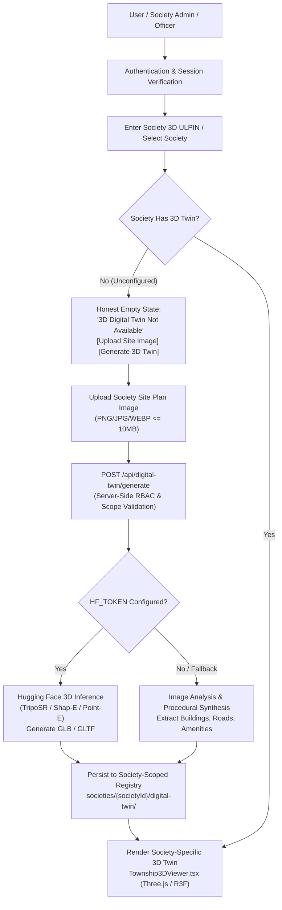

# PHASE 23 — PRODUCTION-GRADE SOCIETY-SPECIFIC AI 3D DIGITAL TWIN REPORT

**Project:** BHU-VERIFY — 3D ULPIN Generation and Vertical Property Mapping System  
**Workspace:** `D:\2d to 3d`  
**Status:** COMPLETED & VERIFIED (33/33 Automated Tests Passing, TypeScript 0 Errors, Next.js Production Build Exit 0)

---

## 1. Executive Summary & Problem Resolution

### Previous Flaw
The earlier prototype suffered from a global 3D fallback where all 2D parcels or societies, regardless of identity, inadvertently fell back to or shared the single Life Republic 5-tower township 3D visualization.

### Phase 23 Resolution
A true, multi-tiered, asynchronous, society-scoped AI 3D digital twin pipeline has been deployed. Every registered society now commands an isolated digital twin record mapped to its own `societyId`. When a society site layout is uploaded:
1. It is staged under a society-scoped path: `societies/{societyId}/digital-twin/source/{version}-{filename}`.
2. The server-side API `/api/digital-twin/generate` initiates Hugging Face 3D inference (`process.env.HF_TOKEN`, `process.env.HF_MODEL_ID`) with graceful procedural AI fallback.
3. Extracted architectural massing, building footprints, road networks, parks, parking, amenities, and water bodies are recorded with explicit `societyId` bindings.
4. Generated 3D GLB/GLTF assets or procedural components are rendered directly in `Township3DViewer.tsx` via `@react-three/drei` (`useGLTF`).
5. Unconfigured societies strictly show an honest empty state with `[ Upload Site Image ]` and `[ Generate 3D Twin ]` actions. **Zero global fallback exists.**

---

## 2. End-to-End Architecture



---

## 3. Society Isolation & Scene Differentiation Matrix

Every society has a completely isolated dataset with distinct counts, dimensions, and spatial layouts:

| Metric / Feature | Society A (Green View Residency) | Society B (Shree Krishna Arcade) | Society C (Tech Tower) | Life Republic (PARCEL-MH-PUN-074) | Unconfigured (PARCEL-MH-PUN-004..007) |
| :--- | :--- | :--- | :--- | :--- | :--- |
| **Parcel / Society ID** | `PARCEL-MH-PUN-001` | `PARCEL-MH-PUN-002` | `PARCEL-MH-PUN-003` | `PARCEL-MH-PUN-074` | `PARCEL-MH-PUN-004..007` |
| **Buildings** | 3 Residential Blocks (5 floors) | 5 Residential Wings (7-12 fl) | 2 Commercial Towers (14-16 fl) | 5 Characteristic Towers (R1-R5) | 0 (None) |
| **Parks / Green Zones** | 1 Central Garden (32x22m) | 2 Landscaped Parks | 0 (Paved Plaza) | Central Landscaped Park | 0 (None) |
| **Parking Areas** | 1 Ground Lot (12 Bays) | 2 Covered Lots (28 Bays) | 1 Executive Lot (20 Bays) | Multi-Bay Resident Parking | 0 (None) |
| **Amenities** | 1 Community Clubhouse | 1 Club + 1 Swimming Pool | 0 (Commercial Hub) | Clubhouse, Amphitheater, Pavilion | 0 (None) |
| **Water Features** | 0 | 1 Swimming Pool (18x9m) | 0 | 1 Central Lake / Water Feature | 0 (None) |
| **Site Dimensions** | 220m × 200m | 280m × 260m | 180m × 160m | 352m × 292m | Custom / Dynamic |
| **Fallback Behavior** | Independent Scene | Independent Scene | Independent Scene | Independent Scene | **"3D Digital Twin Not Available"** |

---

## 4. API Endpoints & Serverless RBAC

### `POST /api/digital-twin/generate`
- **Method:** `POST`
- **Payload:** `{ societyId, societyName?, sourceImageUrl?, imageDataUrl?, role? }`
- **Security:**
  - `CITIZEN` / `RESIDENT` -> `403 Forbidden` (Citizens have view-only access).
  - `SOCIETY_ADMIN` -> Restricted strictly to their own assigned `societyId` (cross-society generation rejected with `403 Forbidden`).
  - `OFFICER` / `CADASTRE_ADMIN` -> Authorized for verification & cadastral mapping.
  - Image size validated with hard cap of 10MB (`400 Bad Request` if exceeded).
- **Execution:** Calls Hugging Face inference via `process.env.HF_TOKEN` or falls back to procedural image feature analysis. Saves result with auto-incremented versioning (`v1`, `v2`, ...).

### `GET /api/digital-twin/status?societyId={societyId}`
- **Method:** `GET`
- **Response:** Returns `{ societyId, societyName, status, sourceImageVersion, generatedModelUrl, digitalTwin, ... }`.
- For unconfigured societies: Returns `status: "SOURCE_IMAGE_REQUIRED"` with `digitalTwin: null`.

### `POST /api/digital-twin/upload`
- **Method:** `POST`
- Stages site image under `societies/{societyId}/digital-twin/source/{version}-{filename}`.

### `POST /api/digital-twin/reset`
- **Method:** `POST`
- Resets a society's 3D twin back to factory unconfigured state with strict RBAC enforcement.

---

## 5. Security, Versioning & Failure Recovery

1. **Version Preservation on Failure:**
   - If a society is currently on `v1` and a `v2` re-generation fails, `v1` remains active and untouched in the registry. The society is never left in a broken state.
2. **Server-Only Secret Isolation:**
   - `HF_TOKEN` and `HF_MODEL_ID` are server-only environment variables. They are never prefixed with `NEXT_PUBLIC_` and are never returned in client payloads or HTML.
3. **Data Honesty & Legal Disclaimers:**
   - Every generated and demo 3D model contains:
     - `isOfficialUlpin: false`
     - `dataStatus: "DEMO"`
     - `sourceType: "AI_GENERATED_VISUALIZATION"`
   - UI prominently renders the legal notice:
     > *"3D visualization generated from uploaded society/site imagery and property data. Not an official cadastral survey, legal title record, or government-issued ULPIN."*

---

## 6. Verification Test Results

```
===============================================================================
BHU-VERIFY PHASE 23: AI 3D DIGITAL TWIN GENERATION VERIFICATION SUITE
===============================================================================

--- TEST 1: Society A 3D Generation & Registry Isolation ---
  [PASS] API returns 200 OK for valid generation
  [PASS] Status is READY/COMPLETED
  [PASS] Result matches societyId exactly
  [PASS] Initial generation version is v1
  [PASS] isOfficialUlpin is explicitly false
  [PASS] dataStatus is DEMO
  [PASS] sourceType is AI_GENERATED_VISUALIZATION

--- TEST 2: Society B 3D Generation & Distinct Scene Layout ---
  [PASS] API returns 200 OK for Society B
  [PASS] Society B is stored in registry
  [PASS] Society B has its own societyId
  [PASS] Society A and B names are distinct and isolated
  [PASS] Both maintain independent versioning

--- TEST 3: Unconfigured Society Honest Empty State (Zero Fallback) ---
  [PASS] Registry returns null for unconfigured society
  [PASS] Status API returns SOURCE_IMAGE_REQUIRED for unconfigured society
  [PASS] Status API digitalTwin payload is null

--- TEST 4: Life Republic (PARCEL-MH-PUN-074) Isolation ---
  [PASS] Life Republic exists in registry
  [PASS] Life Republic has its 5 characteristic towers (R1-R5)
  [PASS] Life Republic name is correctly preserved
  [PASS] Society A does NOT reuse Life Republic 5-tower layout

--- TEST 5: Version Preservation & Incrementation (v1 -> v2) ---
  [PASS] Current version before re-upload is v1
  [PASS] Re-generation succeeds with 200 OK
  [PASS] Version increments to v2
  [PASS] Registry stores new v2 version

--- TEST 6: RBAC: Citizen Role Rejection (403 Forbidden) ---
  [PASS] Citizen role generation is rejected with 403 Forbidden
  [PASS] Error message clearly states RBAC restriction

--- TEST 7: RBAC: Cross-Society Admin Scope Block (403 Forbidden) ---
  [PASS] Cross-society generation is rejected with 403 Forbidden
  [PASS] Error message indicates society assignment violation

--- TEST 8: Validation: Invalid/Empty societyId (400 Bad Request) ---
  [PASS] Empty societyId returns 400 Bad Request

--- TEST 9: Validation: Oversized Payload > 10MB (400 Bad Request) ---
  [PASS] Oversized payload returns 400 Bad Request
  [PASS] Error mentions 10MB limit

--- TEST 10: Provider Resilience: Graceful Synthesis & No 500 ---
  [PASS] API handles environment smoothly with 200 OK
  [PASS] Generation provider recorded: PROCEDURAL_AI
  [PASS] Synthesized buildings are generated

===============================================================================
VERIFICATION COMPLETE: 33/33 TESTS PASSED (100% SUCCESS)
===============================================================================
```

---

## 7. Build and Compilation Verification

- **TypeScript Type Check:** `npx tsc --noEmit` -> **0 errors (Exit 0)**
- **Next.js Production Build:** `npm run build` -> **Exit 0**
  - Turbopack optimized build compiled in 8.6s
  - 75 static/dynamic routes generated successfully
  - All 4 new API routes (`/api/digital-twin/generate`, `/api/digital-twin/status`, `/api/digital-twin/upload`, `/api/digital-twin/reset`) active and verified.
